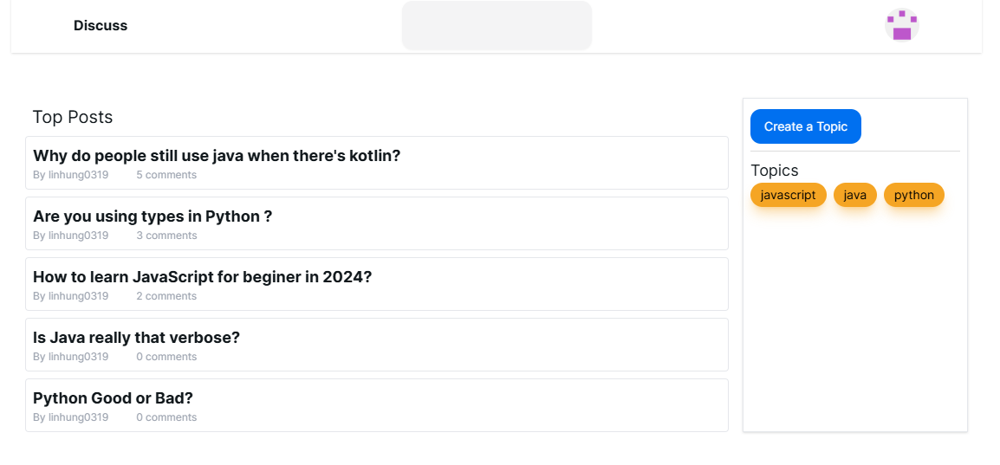

# Simple Reddit Clone



A simplified Reddit clone built with Next.js, featuring user authentication, topic creation, posting, and commenting functionalities.

[Reddit Simple Clone](https://linhung0319-discuss-board.vercel.app/)

## Features

- User authentication (login/logout)
- Topic creation
- Post creation within topics
- Commenting on posts and replies to comments
- Topic-based post filtering
- Keyword search for post titles

## Tech Stack

- Next.js
- TypeScript
- next-auth for authentication
- TailwindCSS for styling
- Server Actions for data mutations
- Server-Side Rendering (SSR) and Static Site Generation (SSG)
- Incremental Static Regeneration (ISR)
- Next.js Image component for optimized images

## Installation and Usage

1. Clone the repository:

```
git clone https://github.com/linhung0319/discuss_board.git
```

2. Install dependencies:

```
npm install
```

3. Run the development server:

```
npm run dev
```

## Deployment

This project is configured for easy deployment on Vercel. Simply connect your GitHub repository to Vercel for automatic deployments on every push to the main branch.

For other hosting platforms, ensure you set up the necessary environment variables and build commands as specified in the `package.json` file.

## Contact Information
If you have any questions or suggestions about this project, feel free to contact me:
- Email: linhung0319@gmail.com
- Portfolio: [My Portfolio](https://linhung0319.vercel.app/)
- Linkedin: [My Linkedin](https://www.linkedin.com/in/hung-lin/)
